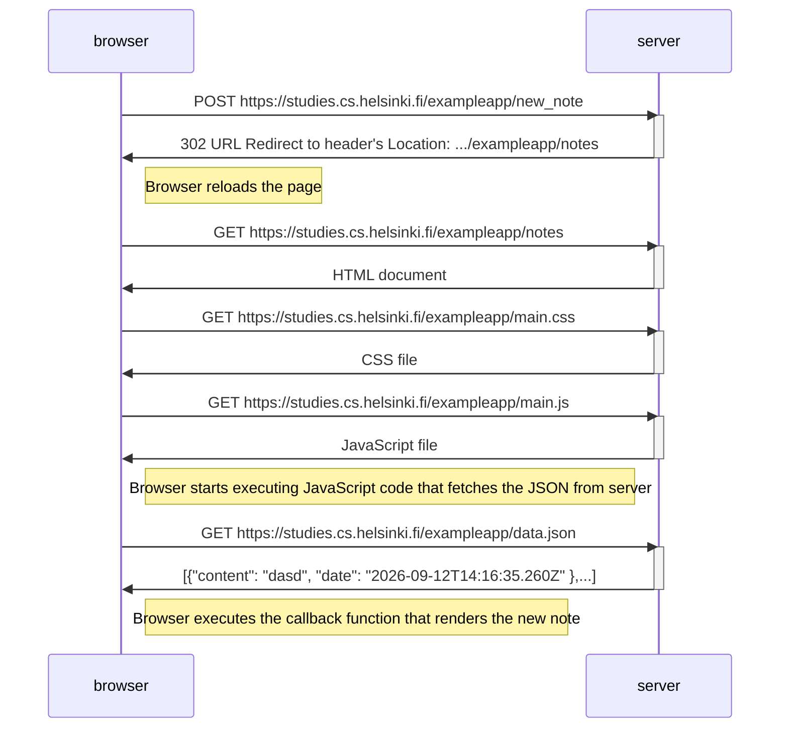

```mermaid

sequenceDiagram
  participant browser
  participant server

  browser->>server: POST https://studies.cs.helsinki.fi/exampleapp/new_note
  activate server
  server->>browser: 302 URL Redirect to header's Location: .../exampleapp/notes
  deactivate server

  Note right of browser: Browser reloads the page

  browser->>server: GET https://studies.cs.helsinki.fi/exampleapp/notes
  activate server
  server->>browser: HTML document
  deactivate server

  browser->>server: GET https://studies.cs.helsinki.fi/exampleapp/main.css
  activate server
  server->>browser: CSS file
  deactivate server

  browser->>server: GET https://studies.cs.helsinki.fi/exampleapp/main.js
  activate server
  server->>browser: JavaScript file
  deactivate server

  Note right of browser: Browser starts executing JavaScript code that fetches the JSON from server

  browser->>server: GET https://studies.cs.helsinki.fi/exampleapp/data.json
  activate server
  server->>browser: [{"content": "dasd", "date": "2026-09-12T14:16:35.260Z" },...]
  deactivate server

  Note right of browser: Browser executes the callback function that renders the new note
  
```
