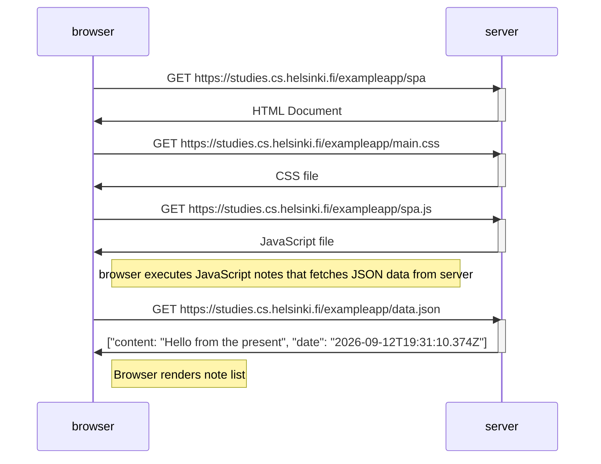

```mermaid

sequenceDiagram
  participant browser
  participant server

  browser->>server: GET https://studies.cs.helsinki.fi/exampleapp/spa
  activate server
  server->>browser: HTML Document
  deactivate server

  browser->>server: GET https://studies.cs.helsinki.fi/exampleapp/main.css
  activate server
  server->>browser: CSS file
  deactivate server

  browser->>server: GET https://studies.cs.helsinki.fi/exampleapp/spa.js
  activate server
  server->>browser: JavaScript file
  deactivate server

  Note right of browser: browser executes JavaScript notes that fetches JSON data from server

  browser->>server: GET https://studies.cs.helsinki.fi/exampleapp/data.json
  activate server
  server->>browser: ["content: "Hello from the present", "date": "2026-09-12T19:31:10.374Z"]
  deactivate server

  Note right of browser: Browser renders note list 
  
```
